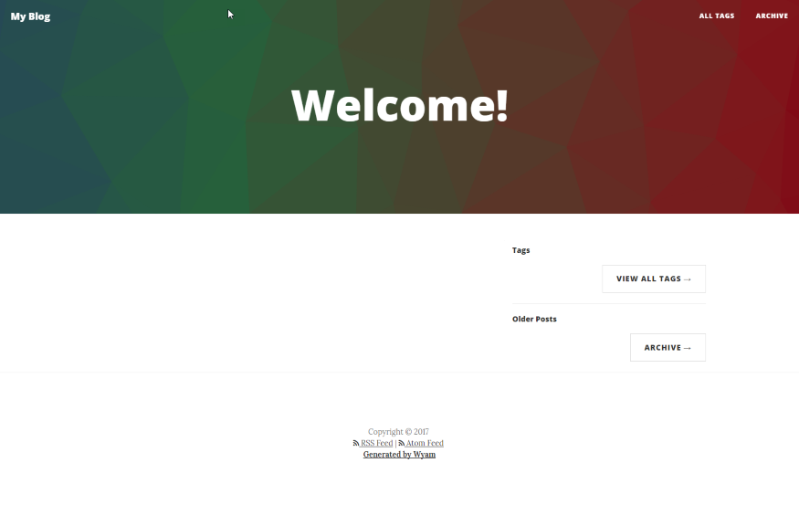
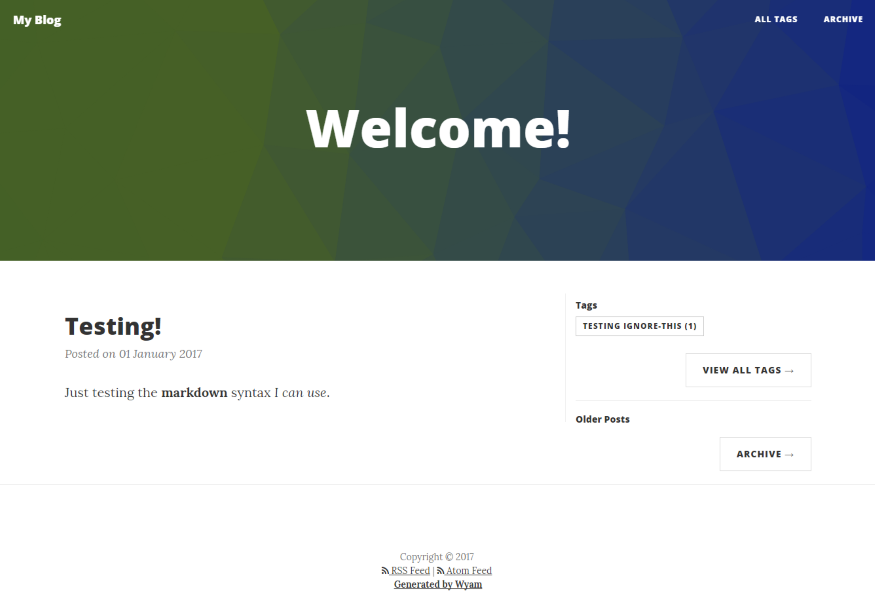
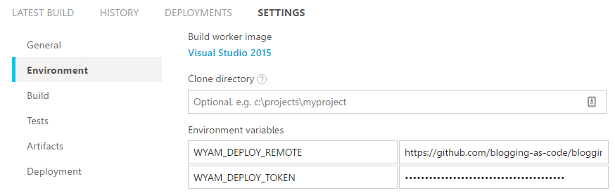
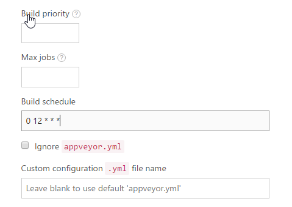

Title: Blogging with WYAM
Published: 24-04-2017
Tags: wyam tooling how-to
---
## Introduction
This blog doesn't have any moving parts at runtime. This is nothing new, people have been doing this for years using all sorts of tools. It works by generating all
required HTML during _compile time_, which has several advantages (to me).
I am mostly interested in two of these advantages: My blog (and all of its content) are expressed as text (or as code, if you will), and I have hardly any deployment
dependencies. As the blog is purely static content, I can deploy it on any host. In my case, [Github Pages][0].

## Introducing Wyam
I was introduced to [Wyam][1] when I was developing a [Cake][2] plugin for [Terraform][3], aptly named [Cake.Terraform][4]. Cake uses Wyam for their documentation,
and as I wanted to align with the conventions used I created my documentation with it as well. While figuring out how it works, I found that Wyam has quite a lot of
extension points, which are used for creating different types of output. One of them being a blog! As I've been thinking about restarting my blogging efforts for quite
some time now, I figured I'd use this to kick it off.

## What I built
Ok, _built_ might be a bit strong. What I taped together fits better! Using my previous experiences, I decided to use the following tools:
 - [Wyam][1], for generating my static blog
 - [Cake][2], for writing the build script
 - [AppVeyor][5], for setting up continuous delivery
 - [GitHub][6], for versioning my content
 - [GitHub Pages][0], for a low cost deployment solution

## How to do it yourself
I started writing this article as I want you to be able to do this just as easily. Mind you, this is not rocket science. You can find out how to do this yourself
by going through the documentation on the tools I used.

### 1. Set up a GitHub repository for your blog
I assume you already have one, but if not, set it up. You will need this to store the content, as well as the compiled static blog. To use GitHub Pages, you will need to set up a repository which a specific name: __[github-username]__.github.io. This repository is special, as it will automatically publish any content in the `master` branch to a domain with the same name. My GitHub username is __erikvanbrakel__, so in my case this is [__erikvanbrakel__.github.io][7].

To prevent having to use two repositories (which I did initially), I created an orphaned `master` branch which is used for publishing, and a `develop` branch for the raw content. Using the commandline, of course!

```bash
# Create a new directory for your blog, and move into it
mkdir blog
cd blog

# initialize the git repository, add remote
git init
git remote add origin git@github.com:[github-username]/[github-username].github.io

# Add the CNAME file (used by GitHub Pages), and commit to the master branch
touch CNAME
git add CNAME
git commit -m "Add CNAME file"
git push origin master

# create an orphaned develop branch, and clear it
git checkout --orphan develop
git reset --hard

# Add a Readme file to the develop branch and commit it
touch README.md
git add README.md
git commit -m "Add README.md file"
git push origin develop
```

Now we're set to build out the automation to start blogging in an open, continuously delivering way.

### 2. Set up Wyam and using Cake
I set up a simple Cake script which downloads Wyam so I can initialize the blog. In the same run I added a task which allows me to generate the blog and run a preview server, a built-in feature of Wyam. I'm using the [Cake.Wyam][8] addin, combined with a Wyam tools package. Both of them available on Nuget. I saved this file as `build.cake`, the default Cake filename.

```csharp
#addin nuget:?package=Cake.Wyam
#tool nuget:?package=Wyam

var target = Argument("Target", "Default");

Task("Default");

Task("Preview")
  .Does(() =>
{
  Wyam(new WyamSettings {
    Preview = true,
    Watch = true,
    InputPaths = new [] { new DirectoryPath("input") }
  });
});

RunTarget(target);
```

You can't simply run a Cake file. It requires a bootstrapper, which is very easily added to your codebase, luckily. It's provided for download on the [Cake website][2]. Using the commandline as always:

```powershell
Invoke-WebRequest http://cakebuild.net/download/bootstrapper/windows -OutFile build.ps1
```

__CAUTION: ALWAYS check the contents of scripts and files downloaded from the web for malicious content!!__

With the plumbing set up, I need a minimal configuration for Wyam. Wyam uses a C# based configuration file in the root of the project, which contains all sorts of overrides , as well as hints for Wyam on how to behave. You can use the `#recipe` directive to tell it what kind of output you want, in our case a blog. So, the configuration file will look like this initially:

```csharp
#recipe Blog

// Make sure to set the DefaultThreadCurrentCulture to something that matches your date format
System.Globalization.CultureInfo.DefaultThreadCurrentCulture
    = System.Globalization.CultureInfo.CreateSpecificCulture("en-GB");

// Set the title of your blog
Settings[BlogKeys.Title] = "[Your blog title here]";
```

Yep, that's it. Nothing special. So now, it's time for the very first run. simply run the Cake script with the correct target (`.\build.ps1 -Target Preview`), and browse to http://localhost:5080. This will present you with an empty blog using the default theme (which at the time of writing, is the one I'm using as well).



### 3. Adding content
Now, with this puppy going, I can start adding content. As I've specified the `input` directory as the input path for Wyam, that's where I'll have to add my posts. Wyam allows me to use Markdown to write my content, so that's exactly what I'll do! Posts will have to go into a subdirectory called posts, and using a custom header in those files
you can specify meta data for your post such as when it's published, categorization using tags, and of course the title. I'll add a simple test post to make sure everything is working as it should:

```markdown
Title: Testing!
Published: 01-01-2017
Tags: Testing ignore-this
---
## Testing header

Just testing the __markdown__ syntax _I can use_.
```

Wyam will automatically pick up the new file, so when refreshing the browser window I immediately see the result:



### 4. Deploying to GitHub Pages
As everything seems to be working locally, I'll add a task to the Cake script which takes the output (which conveniently ends up in the `output` directory) and pushes the changes to the master branch of the repository. To do this, I will need some more functionality: I have to be able to execute git commands, and I need some way to synchronize
the existing content with the new content. Cake has a big list of addins available, and for this I can use the [Cake.Git][9] addin for git commands, and a tool called [Kudu][9] and the accompanying [addin][10] for synchronizing the content. Implemented with Cake, it will look like this:

```csharp
#addin nuget:?package=Cake.Git
#addin nuget:?package=Cake.Kudu

#tool nuget:?package=KuduSync.NET&version=1.3.1

# ...
# removed the previous tasks for brevity
# ...

var deployToken = Argument("DeployToken", EnvironmentVariable("WYAM_DEPLOY_TOKEN"));
var deployRemote = Argument("DeployRemote", EnvironmentVariable("WYAM_DEPLOY_REMOTE"));

Task("Generate")
  .Does(() =>
{
  Wyam(new WyamSettings {
    Preview = false,
    Watch = false,
    InputPaths = new [] { new DirectoryPath("input") }
  });
});

Task("Publish")
  .IsDependentOn("Generate")
  .Does(() =>
{
  var publishFolder = "./publish";

  // Get the SHA from the current commit to use in the message for the commit to master
  var sourceCommit = GitLogTip("./");

  // Clone the repository into the publish folder
  GitClone(deployRemote, publishFolder, new GitCloneSettings { BranchName = "master" });

  // Synchronize the output folder with the master branch
  Kudu.Sync("./output", publishFolder, new KuduSyncSettings { ArgumentCustomization = args=>args.Append("--ignore").AppendQuoted(".git;CNAME") });

  // If there are changes...
  if (GitHasUncommitedChanges(publishFolder))
    {
        // Add all changes...
        GitAddAll(publishFolder);

        // And commit them
        GitCommit(
            publishFolder,
            sourceCommit.Committer.Name,
            sourceCommit.Committer.Email,
            string.Format("AppVeyor Publish: {0}\r\n{1}", sourceCommit.Sha, sourceCommit.Message)
        );

        // Finally, push them to the repository
        GitPush(publishFolder, deployToken, "x-oauth-basic", "master");
    }
});
```

When you run the `Publish` task, it will generate the output through the `Generate` task, and push the changes to the repository. Perfect! But I don't want to run this
manually everytime I make a change. That goes against the purpose of the repository...

### 5. Adding AppVeyor to the mix
I already use [Appveyor][5] to build my [Cake.Terraform][4] addin without any issues, so this was a logical choice. AppVeyor uses a yaml file for configuration, which aligns
nicely with the rest of the repository. We don't need much: specify what script to run, which branches to include, and the opportunity to set environment variables. However, I prefer setting these variables using the AppVeyor web UI, as they won't change too often and make using encrypted parameters a bit easier.

```yaml
# The only build the develop branch
branches:
  only:
    - develop

# execute the cake script with the Publish target
build_script:
  - ps: .\build.ps1 -Target Publish
```

That's all. Now I just need to add a new project to AppVeyor (sign up with your GitHub account if you need to) and add the environment variables (`WYAM_DEPLOY_REMOTE` and `WYAM_DEPLOY_TOKEN`) and we're set!



### 6. Bonus! Scheduled posts (even though you can see them earlier in the source)
By default, Wyam only renders the posts which have a published date before on on the time you run the tool. This means that you can write posts in advance, and have them show up at the time you want. I wanted to utilize this to be able to create content in advance, without having to manually trigger the publishing. Luckily, AppVeyor allows you to schedule builds using a cron expression.



This will run a scheduled build every day at noon, which effectively means that every day, new content will show up when it's scheduled and I don't have to do a thing. The only caveat is that the content will already be available in the repository, but that's not a concern to me. The goal is not to keep the content a secret, but to keep a steady schedule of new content.

[0]: https://pages.github.com/
[1]: https://wyam.io/
[2]: http://cakebuild.net/
[3]: https://www.terraform.io/
[4]: https://github.com/erikvanbrakel/Cake.Terraform
[5]: https://www.appveyor.com/
[6]: https://www.github.com/
[7]: https://github.com/blogging-as-code/blogging-as-code.github.io
[8]: https://github.com/Wyamio/Wyam
[9]: https://github.com/projectkudu/KuduSync.NET
[10]: https://github.com/WCOMAB/Cake.Kudu
